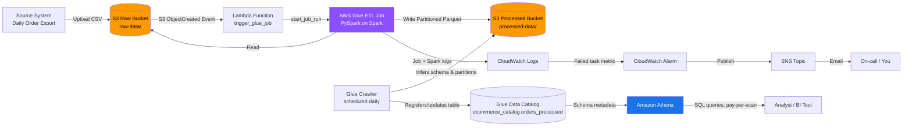

# AWS End-to-End E-Commerce Data Pipeline

A serverless, event-driven batch ETL pipeline built on AWS that ingests raw
e-commerce order data, cleans and transforms it, and makes it queryable for
analytics — with infrastructure defined as code and a CI/CD pipeline to
deploy it.

This project is intentionally laid out in **layers of difficulty** (Basic →
Intermediate → Advanced) so you can build it incrementally, understand
*why* each piece exists, and explain it confidently in interviews or on your
resume.

---

## 1. The Business Problem

An e-commerce company receives a daily CSV export of orders from its
transactional system. Analysts want to answer questions like "what's our
monthly revenue trend?" and "which product categories sell best in each
region?" — but the raw export is messy: duplicate rows, missing prices,
inconsistent text casing, and no structure for fast querying.

This pipeline automates turning that raw export into clean, query-ready
data, with no manual intervention after a file lands in S3.

---

## 2. Architecture


<details>
<summary><b>Same diagram as an editable Mermaid flowchart</b> (click to expand — useful if you want to tweak it directly in Markdown)</summary>



</details>

**Data flow in plain English:**
1. A CSV file is uploaded to the **raw** S3 bucket.
2. That upload event automatically triggers a **Lambda function**.
3. Lambda starts an **AWS Glue ETL job** (a managed Spark job).
4. The Glue job reads the raw CSV, cleans/transforms it, and writes
   **partitioned Parquet** files to the **processed** S3 bucket.
5. A **Glue Crawler** (on a daily schedule) scans the processed bucket and
   keeps the **Glue Data Catalog** table definition up to date — including
   new partitions.
6. **Athena** queries the processed data directly via SQL, using the Data
   Catalog as its schema — there's no database server running anywhere.
7. If the Glue job fails, a **CloudWatch Alarm** fires and publishes a
   message to an **SNS topic**, which emails you.

Every piece of this is **serverless** — nothing is provisioned 24/7. You pay
for Lambda invocations (in milliseconds), Glue job run-time (in minutes),
and Athena queries (per byte scanned). When no data is flowing, the cost is
close to $0.

---

## 3. Difficulty Breakdown

Use this table to decide how much of the project to build, or to explain
to someone else what each layer adds.

| Layer | Components | What it teaches |
|---|---|---|
| **Basic** | S3 (raw + processed buckets), Glue Crawler, Glue Data Catalog, Athena | Core "data lake" pattern: schema-on-read, querying flat files with SQL, no servers to manage |
| **Intermediate** | Glue ETL job (PySpark), S3 event-driven Lambda trigger, partitioning strategy, IAM least-privilege roles | Real transformation logic, event-driven automation, cost-aware data layout, AWS security model |
| **Advanced** | Terraform IaC, GitHub Actions CI/CD, CloudWatch alarms + SNS alerting, Step Functions orchestration (bonus) | Reproducible infrastructure, automated deployment, production-grade monitoring, workflow orchestration |

You can stop after "Basic" and still have a legitimate, explainable
project. Each layer is additive.

---

## 4. Step-by-Step Walkthrough

### Step 1 — Raw data lands in S3
**What:** `data/generate_sample_data.py` generates a synthetic CSV of
e-commerce orders (with realistic data-quality problems baked in: duplicate
rows, missing prices, inconsistent category casing) and you upload it to
the raw bucket.

**Why S3 first, not straight into a database?** S3 is cheap, infinitely
scalable storage that decouples *receiving* data from *processing* it. If
the downstream ETL job is broken, the raw file is still safely sitting in
S3 and can be reprocessed later. This "raw landing zone" pattern is
standard in almost every real data lake architecture.

```bash
python data/generate_sample_data.py --rows 5000 --out orders.csv
aws s3 cp orders.csv s3://<raw-bucket-name>/raw-data/orders.csv
```

### Step 2 — Lambda reacts to the upload
**What:** `lambda/trigger_glue_job.py` is wired to an S3 event notification.
The moment a `.csv` file appears under `raw-data/`, S3 invokes this Lambda
function, which calls `glue.start_job_run()`.

**Why Lambda instead of a cron job?** A cron job ("check S3 every 5
minutes") wastes compute polling for nothing 99% of the time, and adds
latency. An S3-event-triggered Lambda function reacts in near real-time and
costs essentially nothing when idle — you're billed in milliseconds of
execution, and there's no server to keep running.

**Why does Lambda not do the actual data transformation?** Lambda has a
hard 15-minute timeout and limited memory — fine for triggering a job, bad
for processing potentially large datasets. That's a job for Glue/Spark.

### Step 3 — Glue ETL job transforms the data
**What:** `glue/etl_job.py` is a PySpark script that runs on AWS Glue's
managed Spark infrastructure. It:
- Drops exact duplicate orders (`dropDuplicates`)
- Drops rows missing critical fields (`order_id`, `customer_id`, `order_date`)
- Normalizes inconsistent text casing in `category`
- Casts `unit_price`/`quantity` to proper numeric types (bad values become
  null and get filtered out)
- Derives `total_amount`, `order_year`, `order_month`
- Writes the result as **Parquet**, **partitioned by year and month**

**Why Parquet instead of CSV?** Parquet is a columnar format — a query that
only needs `category` and `total_amount` reads just those two columns from
disk, not the entire row. For analytical queries (which usually aggregate a
few columns over millions of rows), this is dramatically faster and
cheaper than row-based CSV.

**Why partition by year/month?** Athena charges by bytes scanned. Without
partitioning, a query for "June 2026 revenue" would scan the *entire*
dataset to find June's rows. With partitioning, Athena only reads the
`order_year=2026/order_month=6/` folder — this is called **partition
pruning**, and it's one of the single biggest cost/performance levers in a
data lake.

### Step 4 — Glue Crawler keeps the catalog current
**What:** A scheduled Glue Crawler scans the processed bucket daily,
detects the schema (column names/types) and partition structure, and
registers or updates a table (`orders_processed`) in the **Glue Data
Catalog**.

**Why a separate Crawler instead of having the ETL job register the table
itself?** You *can* have Glue jobs write directly to the Catalog, but
keeping schema discovery as a separate, scheduled step makes the system
more resilient — if the table definition ever drifts (e.g., a new column
gets added upstream), the crawler self-heals it on its next scheduled run
without needing a code change.

### Step 5 — Athena queries the data
**What:** `athena/queries.sql` contains sample analytical queries — monthly
revenue, top categories, top customers, regional performance — all run
directly against `ecommerce_catalog.orders_processed` with no database
server involved. Athena is a query *engine*, not a database; it reads
schema from the Glue Catalog and data straight from S3.

**Why Athena instead of loading the data into Redshift/RDS?** For
ad-hoc/periodic analytical queries on data that doesn't need
millisecond-latency lookups, querying S3 directly avoids running (and
paying for) a database server at all. You'd reach for Redshift when query
volume/concurrency gets high enough that Athena's per-query model becomes
more expensive than a provisioned warehouse — that's a deliberate
trade-off, not a default.

### Step 6 — Monitoring and alerting
**What:** A CloudWatch Alarm watches the Glue job's failed-task metric. If
it fires, it publishes to an SNS topic, which emails you.

**Why this matters:** A pipeline that fails silently is worse than one that
fails loudly. In a real production pipeline, "the data just didn't update
and nobody noticed for three days" is a far more common and damaging
failure mode than the pipeline crashing visibly.

### Step 7 (Advanced/Bonus) — Step Functions orchestration
**What:** `step_functions/state_machine.json` defines an alternative
orchestration flow — Start Crawler → Poll until ready → Start ETL Job →
Notify success/failure — using AWS Step Functions instead of the simpler
Lambda S3-trigger pattern.

**Why include both patterns?** The Lambda-trigger pattern (Steps 2-3 above)
is simpler and great for a single linear flow. Step Functions earns its
complexity when you have **branching, retries with backoff, parallel
tasks, or you want a visual execution history** in the AWS console for
debugging multi-step workflows. Knowing when *not* to reach for an
orchestrator is as valuable as knowing how to use one.

### Step 8 — Infrastructure as Code (Terraform)
**What:** The `terraform/` directory defines every resource above — S3
buckets, IAM roles, the Glue database/crawler/job, the Lambda function and
its S3 trigger permission, the Athena workgroup, and the
CloudWatch/SNS alerting — as code.

**Why Terraform instead of clicking through the AWS Console?** Console
clicks aren't reproducible, aren't version-controlled, and aren't
reviewable in a pull request. With Terraform, the entire pipeline can be
torn down and rebuilt identically with `terraform apply`, and every
infrastructure change goes through the same code review process as
application code.

**Key design choices worth being able to explain:**
- IAM roles are scoped per-service (`iam.tf`) — Glue's role can't touch
  resources Lambda doesn't need, and vice versa.
- `s3.tf` blocks all public access on every bucket by default and enables
  server-side encryption — this is "secure by default," not bolted on
  later.
- The Athena workgroup sets a **1 GB bytes-scanned cap per query**
  (`athena.tf`) as a guardrail against an accidentally expensive query.

### Step 9 — CI/CD (GitHub Actions)
**What:** `.github/workflows/deploy.yml` runs on every push/PR:
1. Lints the Python scripts (`flake8`)
2. Runs `terraform fmt -check` and `terraform validate`
3. On a push to `main` only, runs `terraform plan` then `terraform apply`

**Why gate `apply` behind a GitHub "environment"?** The workflow targets a
`production` environment, which you can configure in GitHub repo settings
to require manual approval before deploying. This mirrors how real teams
prevent an unreviewed change from silently reconfiguring production cloud
infrastructure.

---

## 5. Repository Structure

```
aws-ecommerce-data-pipeline/
├── docs/
│   ├── architecture.png            # Static architecture diagram (for the README)
│   └── architecture.svg            # Vector source of the same diagram
├── data/
│   └── generate_sample_data.py     # Simulates the raw data source
├── lambda/
│   └── trigger_glue_job.py         # S3-event-triggered Glue job starter
├── glue/
│   └── etl_job.py                  # PySpark ETL: clean, transform, partition
├── athena/
│   └── queries.sql                 # Sample analytical SQL queries
├── step_functions/
│   └── state_machine.json          # Bonus: orchestration alternative
├── terraform/
│   ├── main.tf                     # Provider + backend config
│   ├── variables.tf
│   ├── s3.tf                       # 4 buckets + S3->Lambda trigger
│   ├── iam.tf                      # Least-privilege roles
│   ├── glue.tf                     # Catalog DB, Crawler, ETL Job
│   ├── lambda.tf                   # Lambda function + invoke permission
│   ├── athena.tf                   # Workgroup + CloudWatch alarm + SNS
│   └── outputs.tf
├── .github/workflows/
│   └── deploy.yml                  # Lint -> validate -> plan -> apply
├── requirements.txt
├── .gitignore
├── LICENSE
└── README.md
```

---

## 6. How to Deploy This Yourself

> **Prerequisites:** an AWS account, the AWS CLI configured
> (`aws configure`), and [Terraform](https://developer.hashicorp.com/terraform/install) >= 1.5.

```bash
# 1. Clone the repo
git clone https://github.com/<you>/aws-ecommerce-data-pipeline.git
cd aws-ecommerce-data-pipeline

# 2. Review and adjust variables (region, project name, alert email)
#    Either edit terraform/variables.tf defaults, or pass -var flags below.

# 3. Provision the infrastructure
cd terraform
terraform init
terraform plan -var="alert_email=you@example.com"
terraform apply -var="alert_email=you@example.com"

# 4. Confirm the SNS email subscription (check your inbox)

# 5. Generate and upload sample data
cd ..
python data/generate_sample_data.py --rows 5000 --out orders.csv
aws s3 cp orders.csv s3://$(terraform -chdir=terraform output -raw raw_bucket_name)/raw-data/orders.csv

# 6. Watch it run
#    - Lambda logs:  CloudWatch Logs -> /aws/lambda/<project>-trigger-glue
#    - Glue job run: AWS Glue Console -> Jobs -> <project>-etl-job -> Runs
#    - Once it succeeds, run the crawler manually the first time
#      (it's also scheduled daily): AWS Glue Console -> Crawlers -> Run

# 7. Query it in Athena
#    Athena Console -> select the workgroup created above -> run
#    queries from athena/queries.sql

# 8. Tear it down when you're done (avoid ongoing charges)
cd terraform
terraform destroy
```

---

## 7. Cost Notes

This project is designed to stay near the **AWS Free Tier** for light,
intermittent use:
- **S3**: pennies/month for a few GB of demo data.
- **Lambda**: free tier covers 1M requests/month — a few uploads cost ~$0.
- **Glue**: billed per DPU-hour while the job runs (`G.1X` workers here);
  a 5-minute demo job run costs a few cents.
- **Athena**: $5 per TB scanned — querying a few hundred MB costs
  fractions of a cent. The 1 GB per-query cap in `athena.tf` prevents
  surprise bills from a runaway query.
- **Step Functions / CloudWatch / SNS**: negligible at this scale.

**Always run `terraform destroy` when you're done experimenting** — S3
buckets and Glue resources don't cost much sitting idle, but it's good
practice and keeps your account tidy.

---

## 8. How to Explain This Project (Interview Cheat Sheet)

**30-second pitch:**
> "I built a serverless ETL pipeline on AWS that ingests raw e-commerce
> order data, cleans and transforms it with a PySpark Glue job, and makes
> it queryable through Athena via the Glue Data Catalog. It's
> event-driven — an S3 upload automatically triggers the whole pipeline
> through Lambda — and the entire infrastructure is defined in Terraform
> with a GitHub Actions pipeline that validates and deploys it."

**Questions you should be ready for, and the short answer:**

| Likely question | Short answer |
|---|---|
| Why Glue instead of just doing this in Lambda? | Lambda has a 15-min timeout and limited memory; Glue runs on managed Spark, built for larger-scale data transformation. |
| Why Parquet and partitioning? | Columnar storage + partition pruning cuts Athena's bytes-scanned (and therefore cost), since Athena bills per byte scanned. |
| How do you handle pipeline failures? | A CloudWatch alarm on the Glue job's failed-task metric publishes to SNS, which emails an alert — failures aren't silent. |
| How would you scale this for real production data volumes? | Increase Glue worker count/type, consider AWS Step Functions for more complex branching, and evaluate moving high-concurrency queries from Athena to Redshift if query volume grows. |
| Why Terraform instead of manual console setup? | Reproducibility and code review — infrastructure changes go through the same PR process as code changes, and the whole environment can be rebuilt identically. |
| What would you add if you had more time? | Data quality checks (e.g. with AWS Glue Data Quality or Great Expectations), a dead-letter queue for failed Lambda invocations, and a QuickSight dashboard on top of the Athena tables. |

---

## 9. Possible Future Enhancements

- **QuickSight dashboard** on top of the Athena tables for a visual layer
- **Data quality validation** step (e.g. Great Expectations, or AWS Glue
  Data Quality rules) before writing to the processed bucket
- **Dead-letter queue (SQS)** for Lambda invocations that fail to start
  the Glue job
- **Multiple source feeds** (e.g. a second "customers" dataset) joined
  during the ETL step
- **Apache Airflow (Amazon MWAA)** as an alternative orchestrator to Step
  Functions, if the workflow grows more complex

---

## License

MIT — see [LICENSE](LICENSE).
