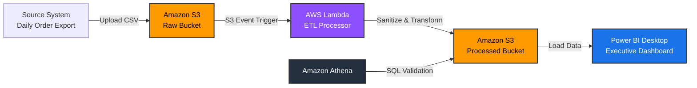

# Cloud-Native End-to-End E-Commerce ETL Pipeline on AWS with Power BI Dashboard

A cloud-native, serverless ETL pipeline built on AWS that ingests raw e-commerce order data, cleans and transforms it using AWS Lambda, stores the processed dataset in Amazon S3, validates it using Amazon Athena, and visualizes key business insights through an interactive Power BI dashboard. The entire cloud infrastructure is provisioned using Terraform (Infrastructure as Code) and can be deployed through a GitHub Actions CI/CD pipeline.

---

# 1. Business Problem

An e-commerce company receives daily CSV exports containing customer orders from its transactional system. Business analysts need reliable data to answer questions such as:

* What is the monthly revenue trend?
* Which product categories generate the highest sales?
* Which regions contribute the most revenue?
* How many orders are placed each day?

Unfortunately, the raw datasets often contain common data-quality issues such as:

* Duplicate records
* Missing prices
* Inconsistent text casing
* Schema inconsistencies
* Invalid numeric values

Cleaning this data manually is time-consuming and error-prone.

This project automates the complete data ingestion and transformation process, ensuring that every uploaded file is converted into an analytics-ready dataset without manual intervention.

---

# 2. Architecture & Data Flow



## Data Flow

1. A CSV file containing daily e-commerce orders is uploaded to the **Amazon S3 Raw Bucket**.
2. The upload event automatically triggers an **AWS Lambda** function.
3. The Lambda function validates, cleans, and transforms the raw data using Python.
4. The cleaned dataset is stored in the **Amazon S3 Processed Bucket**.
5. **Amazon Athena** runs SQL queries directly on the processed data for validation and ad-hoc analysis.
6. **Power BI Desktop** imports the processed dataset to build an interactive executive dashboard.

---

# 3. Dashboard Preview

> Add your dashboard screenshot here.

```text
images/dashboard_preview.png
```

or

```markdown

```

---

# 4. Tech Stack

| Category               | Technologies   |
| ---------------------- | -------------- |
| Cloud Platform         | AWS            |
| Storage                | Amazon S3      |
| Compute                | AWS Lambda     |
| Query Engine           | Amazon Athena  |
| Programming Language   | Python         |
| Infrastructure as Code | Terraform      |
| CI/CD                  | GitHub Actions |
| Business Intelligence  | Power BI       |
| Query Language         | SQL            |
| Data Modeling          | DAX            |

---

# 5. Core Technical Features

| Component      | Purpose                          | Demonstrates                                   |
| -------------- | -------------------------------- | ---------------------------------------------- |
| Amazon S3      | Raw and Processed storage layers | Data lake architecture and data separation     |
| AWS Lambda     | Event-driven ETL processing      | Serverless data transformation using Python    |
| Amazon Athena  | SQL validation                   | Serverless analytics using Schema-on-Read      |
| Power BI       | Dashboard creation               | KPI reporting, visualization, and DAX measures |
| Terraform      | Infrastructure provisioning      | Infrastructure as Code (IaC)                   |
| GitHub Actions | CI/CD automation                 | Automated deployment pipeline                  |

---

# 6. Key Features

* Fully serverless ETL architecture
* Event-driven processing using AWS Lambda
* Automated data cleaning and transformation
* Separate Raw and Processed data layers
* SQL validation using Amazon Athena
* Interactive Power BI dashboard
* Infrastructure provisioned using Terraform
* GitHub Actions CI/CD pipeline
* Analytics-ready output dataset
* AWS Free Tier friendly
